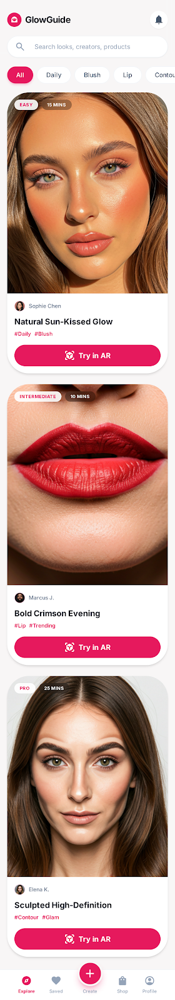

# GlowGuide

GlowGuide는 프리미엄 AI-native AR 메이크업 코칭 소셜 앱 MVP입니다.  
기존 Figma Make HTML export는 참고용으로만 두고, 실제 앱은 React Native + Expo + TypeScript + Expo Router로 모바일 우선 구현했습니다.

## Current Scope

구현된 사용자 플로우:

- Home / Explore: 메이크업 룩 피드, 검색바, 카테고리 필터
- Look Detail: 룩 상세, 크리에이터 정보, 난이도/시간/스텝 수, 제품 리스트, 적용 스텝
- AR Coaching: 실제 카메라/AR 대신 mock camera UI와 React Native overlay guide 구현
- Look Completed: before/after 비교 mock, 점수, achievement, 제품 리스트, 저장/재시도 액션
- Creator Profile: 크리에이터 헤더, 통계, featured look, 룩 그리드

아직 구현하지 않은 범위:

- Creator Editor
- 실제 Expo Camera 연동
- MediaPipe, face tracking, 실시간 AR 분석
- 백엔드, 인증, 결제, 실제 커머스 연동

## Design References

`Design/` 폴더의 HTML은 레이아웃, 색상, 간격, UI hierarchy 참고용입니다.  
각 `screen.png`는 현재 MVP의 시각 기준 및 임시 이미지 placeholder로 사용하거나 참고합니다.

### Home



### Look Detail


### AR Coaching


### Look Completed


### Creator Profile


### Creator Editor

Creator Editor는 현재 MVP 범위에서 제외되어 있으며, 추후 creator-facing 기능 구현 시 참고합니다.


## Tech Stack

- Expo
- React Native
- TypeScript
- Expo Router
- React Native `StyleSheet`
- Expo Web for desktop development review

UI는 웹앱으로 재작성하지 않았고, `div`, `img`, `p`, `button` 같은 HTML 태그를 직접 사용하지 않습니다.  
주요 UI는 `View`, `Text`, `Image`, `Pressable`, `ScrollView`, `FlatList`, `SafeAreaView` 등 React Native 컴포넌트로 구성되어 있습니다.

## Project Structure

```text
app/
  _layout.tsx
  index.tsx
  look/
    [id].tsx
  coaching/
    [id].tsx
  completed/
    [id].tsx
  creator/
    [id].tsx

src/
  shared/
    components/
    constants/
    data/
  features/
    home/
    look/
    coaching/
    creator/
```

## Run

Install dependencies:

```bash
npm install
```

Run for mobile development:

```bash
npx expo start
```

Run on desktop with Expo Web for quick UI review:

```bash
npx expo start --web
```

Typecheck:

```bash
npm run typecheck
```

## Verification

최근 확인한 검증 커맨드:

```bash
npm run typecheck
npx expo install --check
npx expo export --platform web
```

## Notes

- Primary target은 iOS/Android 모바일 앱입니다.
- Expo Web은 개발 중 빠른 UI 리뷰를 위한 보조 실행 환경입니다.
- 현재 AR Coaching 화면은 실제 AR이 아니라 mock camera 배경과 native overlay shape로 구성되어 있습니다.
- `Design/**/screen.png`는 임시 visual asset 및 design reference로만 사용합니다.
